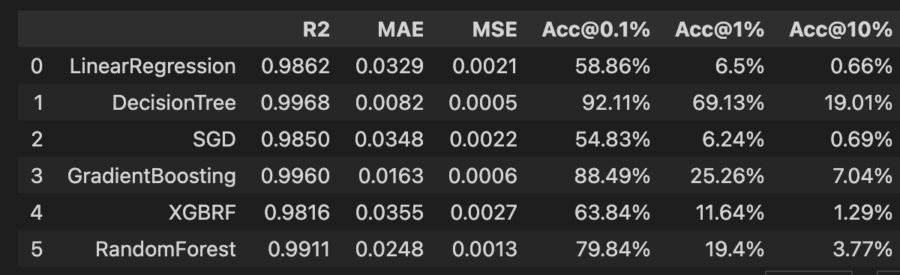

# penicillin-prediction
Test repository for exploring Penicillin production prediction

[Paper](https://www.sciencedirect.com/science/article/pii/S0098135418305106#tbl0001)

## Model Styles
Accuracy
|                | Deep NN | Regression |
|----------------|---------|------------|
| **Tollerance** |         |            |
| 10%            | 63%     | 92%         |
| 1%             | 7%      | 70%        |
| *0.1%          | 0.7%    | 18%        |
\*: Target

> Clearly regression is the way to go

# Using Regression
## Tuning Ensemble Regressors
Settings
```py
grid = GridSearchCV(MODEL_NAME(), param_grid, refit = True, verbose = 3, n_jobs=-1);
regr_trans = TransformedTargetRegressor(regressor=grid, transformer=QuantileTransformer(output_distribution='normal'))

# fitting the model for grid search
grid_result=regr_trans.fit(xtrain, ytrain)
best_params=grid_result.regressor_.best_params_
print(best_params) # Gives Result
```


**xg.XGBRFRegressor():**
```python
# Tuning
param_grid = {
    'n_estimators': list(range(40,100,5)),
    'max_depth': list(range(4,10,1)),
    'reg_lambda' : [x / 100 for x in range(18,30,2)]
}
# RESULT: {'max_depth': 4, 'n_estimators': 85, 'reg_lambda': 0.18} # 75min
```

**GradientBoostingRegressor():**
```py
param_grid = {
    'n_estimators': list(range(60,90,5)),
    'learning_rate' : [x / 100 for x in range(5,30,5)],
    'max_depth': list(range(4,10,1))
}
# {'learning_rate': 0.25, 'max_depth': 7, 'n_estimators': 80}; 64min
```
**RandomForestRegressor():**
```py
param_grid = {
    'n_estimators': list(range(40,120,5)),
    'max_depth': list(range(2,8,1))
}
# {'max_depth': 7, 'n_estimators': 65} # 25 min
```

### Full Results
