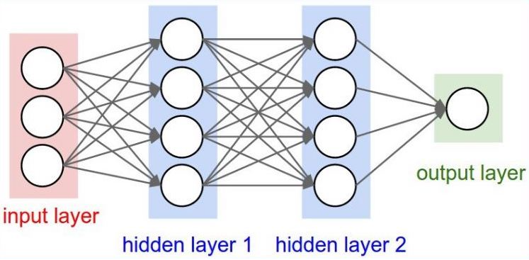

# Neural Net Arch

<h5 v-if="false">This Document is best seen on the Docs host</h5>

## Model Choice
Since not much complexity is needed due to `Array<int>` inputs and `Array<int>` outputs it makes most sense to go for a simple Input Layer and Output layer with 2 hidden layers network. If the constraints were even simpler it would be possible to get away with just an LPP but in absence of specified boundaries it seems like a simple ML model is sufficient

The 2 hidden layers are also Overkill and are included for future-proofing. A simple regression model would be too prone to errors since chemical reactions may tend to runaway and not always be smooth

## Hidden Layers
- $N_h$ = # nodes in hidden layer
- $N_i$ = # input neurons
- $N_o$ = # output neurons
- $N_s$ = # samples in training data set
- $\alpha$ = random scaling factor ~ 2-10. let 5

**Hidden Layer Size formula** [^1]: (Intuition)
You want to limit the number of free parameters in your model (its degree or number of nonzero weights) to a small portion of the degrees of freedom (DoF) in your data.
The DoF in your data is the number samples * dimensions in each sample or $N_s∗(N_i+N_o)$ (assuming they're all independent). So $\alpha$ is a way to indicate how general you want your model to be, or how much you want to prevent overfitting.

For an automated procedure you'd start with an α of 2 (twice as many DoF in your training data as your model) and work your way up to 10 if the error (loss) for your training dataset is significantly smaller than for your test dataset.
$$
N_h = \frac{N_s}{\alpha ∗ ( N_i + N_o)}
$$

<fieldset class="soft-border" style="border-radius:5px;max-width:100%;overflow-x:scroll">
<legend>Calculator</legend>

    

        Input Count:  
        <input type="number" v-model="ni" :min="0"/>
    

    

        Output Count:  
        <input type="number" v-model="no" :min="0"/>
    

    

        Scale Factor: (max: 10)  
        <input type="number" v-model="al" :min="0"/>
    

    

        Sample Size:  
        <input type="number" v-model="ns" :min="0"/>
    

    $N_h = $ {{Math.round(ns/(al* (ni+no)))}}

</fieldset>

[^1]: https://hagan.okstate.edu/NNDesign.pdf#page=469