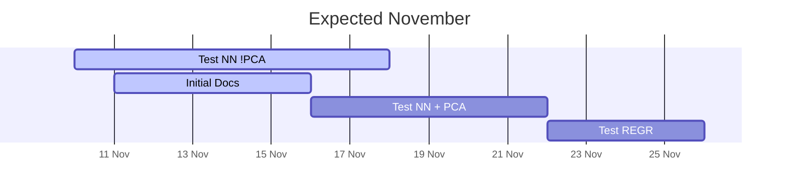
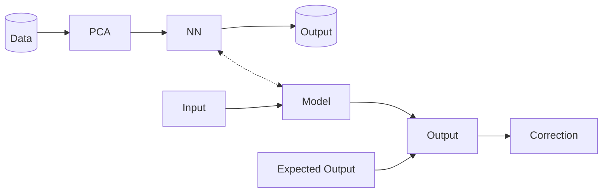

# penicillin-prediction
Repository for exploring Penicillin production prediction application


## Folder Structure

```
root
└─── README.md
│
└───pdf
└───docs
└───server
└───client
└───ml
```

## Main Objective Variables
We need to use the following inputs
1. Time (h)
2. Substrate concentration(S:g/L)
3. Sugar feed rate(Fs:L/h)
4. Acid flow rate(Fa:L/h)
5. Base flow rate(Fb:L/h)
6. Ammonia
7. Temperature(T:K)
8. Water Flow [SUM OF (Fc+Fh+Fw)]

In order to accurately predict
1. Penicillin concentration(P:g/L)
2. pH(pH:pH)
3. Vessel Volume(V:L)


## Timeline



## Overview

- **PCA**: Principle Component Analysis
- **NN**: Neural Net



