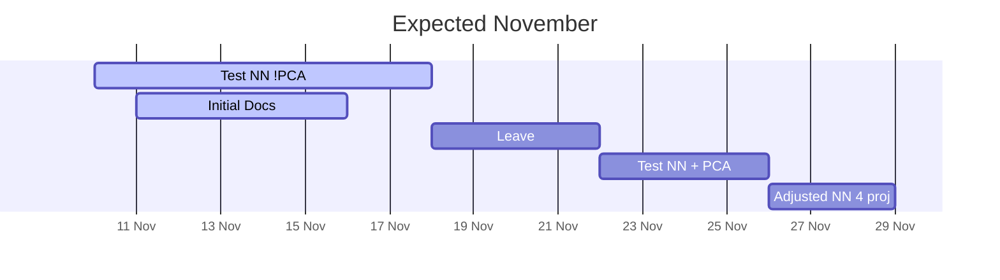
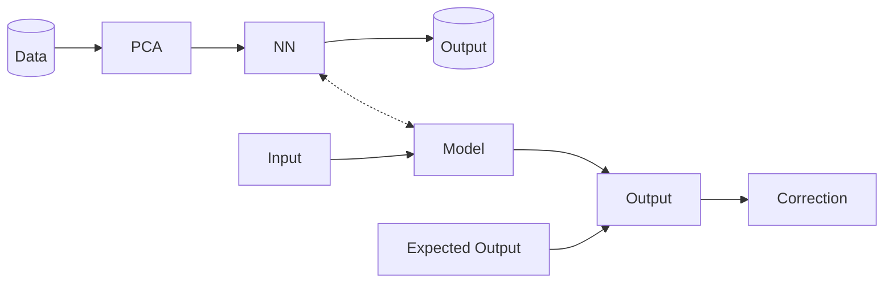

# penicillin-prediction
Repository for exploring Penicillin production prediction application


## Folder Structure

```
root
└─── README.md
│
└───pdf
└───docs
└───server
└───client
└───ml
```


## Timeline



## Overview

- **PCA**: Principle Component Analysis
- **NN**: Neural Net



