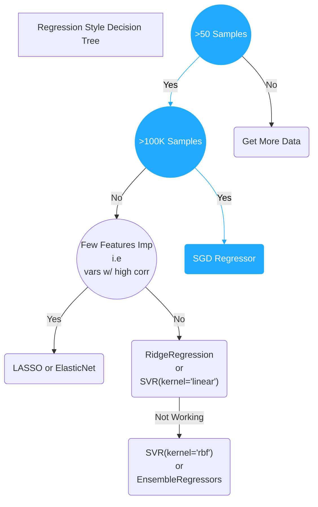

# Timeline of Making Regression



After using SGDRegressor the results were not good enough therefore we will now check all forms of regression


# Prediction via Regression
|   |                  | R2     | MAE    | MSE    | Acc@10% | Acc@1% | Acc@0.1% |
|---|------------------|--------|--------|--------|----------|--------|---------|
| 0 | LinearRegression | 0.9862 | 0.0329 | 0.0021 | 58.86%   | 6.5%   | 0.66%   |
| 1 | DecisionTree     | 0.9968 | 0.0082 | 0.0005 | 92.11%   | 69.13% | 19.01%  |
| 2 | SGD              | 0.9850 | 0.0348 | 0.0022 | 54.83%   | 6.24%  | 0.69%   |
| 3 | GradientBoosting | 0.9960 | 0.0163 | 0.0006 | 88.49%   | 25.26% | 7.04%   |
| 4 | XGBRF            | 0.9816 | 0.0355 | 0.0027 | 63.84%   | 11.64% | 1.29%   |
| 5 | RandomForest     | 0.9911 | 0.0248 | 0.0013 | 79.84%   | 19.4%  | 3.77%   |

We can clearly see we need to use `DecisionTree` by a large margin. This was decided after running 1000s of GridSearch as follows

## Tuning Ensemble Regressors
Settings
```py
grid = GridSearchCV(MODEL_NAME(), param_grid, refit = True, verbose = 3, n_jobs=-1);
regr_trans = TransformedTargetRegressor(regressor=grid, transformer=QuantileTransformer(output_distribution='normal'))

# fitting the model for grid search
grid_result=regr_trans.fit(xtrain, ytrain)
best_params=grid_result.regressor_.best_params_
print(best_params) # Gives Result
```


**xg.XGBRFRegressor():**
```python
# Tuning
param_grid = {
    'n_estimators': list(range(40,100,5)),
    'max_depth': list(range(4,10,1)),
    'reg_lambda' : [x / 100 for x in range(18,30,2)]
}
# RESULT: {'max_depth': 4, 'n_estimators': 85, 'reg_lambda': 0.18} # 75min
# 1296x3 runs
```

**GradientBoostingRegressor():**
```py
param_grid = {
    'n_estimators': list(range(60,90,5)),
    'learning_rate' : [x / 100 for x in range(5,30,5)],
    'max_depth': list(range(4,10,1))
}
# {'learning_rate': 0.25, 'max_depth': 7, 'n_estimators': 80}; 64min
# 540x3 runs
```
**RandomForestRegressor():**
```py
param_grid = {
    'n_estimators': list(range(40,120,5)),
    'max_depth': list(range(2,8,1))
}
# {'max_depth': 7, 'n_estimators': 65} # 25 min
# 288x3 runs
```


<style>
    .edgeLabel{
        border-radius: 5px;
        padding: 2px 7px;
    }
</style>

# DecisionTree
We will now run a few GridSearches for understanding how to search for better features and NOT focus on accuracy as much for now. An improvement of within 2% at 13%, is useless and is a fluctuation
```py
parameters={
    "splitter":["best","random"],
    "max_depth" : [i for i in range(1,20)],
    "min_samples_leaf":[i for i in range(10)],
    "min_weight_fraction_leaf":[float(i)/10 for i in range(10)],
    "max_features":[1.0,"log2","sqrt",None],
    "max_leaf_nodes":[None,10,20,30,40,50,60,70,80,90]
}
# 1.44M tests
```

After running 1.4M tests from the above configurations it was noticed that
- `max_features` is a useless variable,
- `max_depth` must be b/w 10-14
- `min_weight_fraction_leaf` should be 0.0 or 0.1
- Everything else is dynamic therefore based on top 15 values

```py
parameters={
    "splitter":["best","random"],
    "max_depth" : [i for i in range(10,15)],
    "min_samples_leaf":[i for i in range(4,11)],
    "min_weight_fraction_leaf":[0.0, 0.1],
    "max_leaf_nodes":[i*10 for i in range(6,12)]
}
```

## Making Decision Tree better
We now make the actual data better. Since the dataset is timeseries, it is impossible to make a chemical reaction with 0 knowledge of previous steps, therefore we will now create moving windows of all columns and calculate: `mean, std, max, min` and effectively make dataset 5 times larger.

These values will now allow us to account for