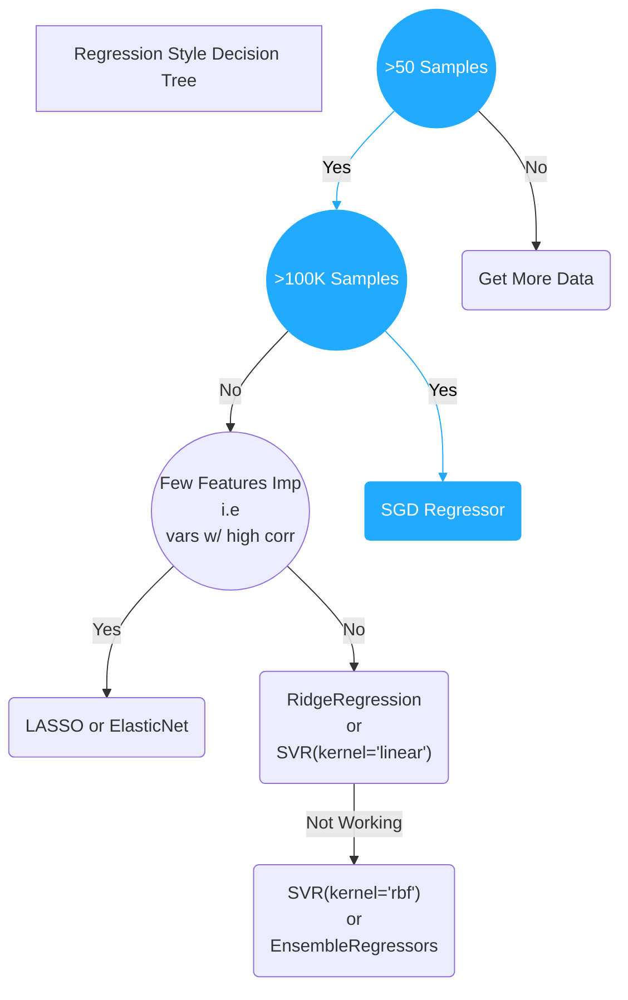

# Prediction via Regression
We can see from below the exact style of regression we need is `Multivariate SGD Regression`

```mermaid
flowchart TB
    Legend1["Regression Style Decision Tree"]

    P50S((>50 Samples))
    P100S((>100K Samples))
    FFS(("
    Few Features Imp
    i.e
    vars w/ high corr
    "))

    GMD(Get More Data)
    SGD(SGD Regressor)
    LASSO(LASSO or ElasticNet)
    Ridge("
    RidgeRegression
    or
    SVR(kernel='linear')
    ")
    RBF("
    SVR(kernel='rbf')
    or
    EnsembleRegressors
    ")

    classDef selected fill:#2af,stroke:none,color:#fff;

    class P100S,P50S,SGD selected;

    P50S -- No --> GMD
    P50S -- Yes --> P100S
    linkStyle 1 stroke:#2af,color:black;

    P100S -- Yes --> SGD
    P100S -- No --> FFS
    linkStyle 2 stroke:#2af,color:black;

    FFS -- Yes --> LASSO
    FFS -- No --> Ridge
    Ridge -- Not Working --> RBF
```
