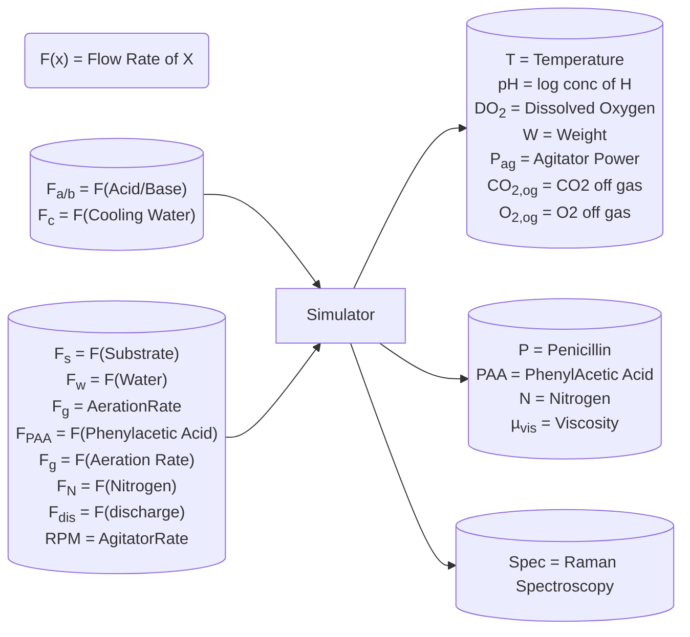

# Paper Summary

## Model Outputs

### Simulator Design

### Control Strategy for Variables

<table>
   <thead>
      <tr class="rowsep-1">
         <th scope="col">Variable reference</th>
         <th scope="col">Primary control variables</th>
         <th scope="col">Control strategy</th>
      </tr>
   </thead>
   <tbody>
      <tr>
         <td>Dissolved O2 (<em>DO2 -</em> mg L−1)</td>
         <td>Fg,RPM</td>
         <td>&gt;10% of saturation</td>
      </tr>
      <tr>
         <td>Weight (<em>W -</em> kg)</td>
         <td>Fwater,Fs,Fa/b,FPAA,Fdis</td>
         <td>Maintain between 7 ×104 and 11×104 kg</td>
      </tr>
      <tr>
         <td>pH (<em>pH</em>)</td>
         <td>Fa/b</td>
         <td>PID control algorithm</td>
      </tr>
      <tr>
         <td>Temperature (<em>T - K</em>)</td>
         <td>Fc</td>
         <td>PID control algorithm</td>
      </tr>
      <tr>
         <td>Off-gas values (CO2,og &amp; O2, og -%)</td>
         <td>Fg, RPM</td>
         <td>Not controlled</td>
      </tr>
      <tr>
         <td>Penicillin (<em>P -</em> g L−1)</td>
         <td>FS,Foil,FPAA,FN</td>
         <td>Maximise production</td>
      </tr>
      <tr>
         <td>Biomass (<em>X -</em> g L−1)</td>
         <td>FS,Foil,FPAA,FN</td>
         <td>Maximise production</td>
      </tr>
      <tr>
         <td>Phenylacetic acid (<em>PAA</em> - mg L<em>−1</em>)</td>
         <td>FPAA</td>
         <td>Maintain between 600 and 1800 mg L−1</td>
      </tr>
      <tr>
         <td>Nitrogen (<em>N -</em> mg L−1)</td>
         <td>Nshots,Foil,FPAA</td>
         <td>Maintain above 300 mg L−1</td>
      </tr>
      <tr>
         <td>Viscosity (<em>μ</em> - cP)</td>
         <td>Fwater</td>
         <td>Maintain below 100 cP</td>
      </tr>
      <tr>
         <td>Substrate (<em>S -</em> g L−1)</td>
         <td>Fs,Foil</td>
         <td>Maintain between 5 × 10−3 and 1  ×  10−3 g L−1</td>
      </tr>
   </tbody>
</table>
