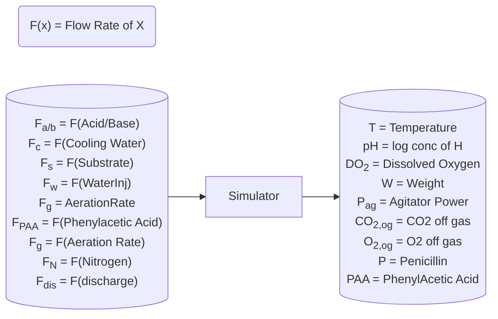

# Simulator & Dataset Summary

## Model Outputs


### Simulator Design


### Control Strategy for Variables

<table>
   <thead>
      <tr class="rowsep-1">
         <th scope="col">Variable reference</th>
         <th scope="col">Primary control variables</th>
         <th scope="col">Control strategy</th>
      </tr>
   </thead>
   <tbody>
      <tr>
         <td>Dissolved O2 (<em>DO<sub>2</sub> -</em> mg L<sup>−1</sup>)</td>
         <td>F<sub>g</sub>,RPM</td>
         <td>&gt;10% of saturation</td>
      </tr>
      <tr>
         <td>Weight (<em>W -</em> kg)</td>
         <td>F<sub>water</sub>,F<sub>s</sub>,F<sub>a/b</sub>,F<sub>PAA,</sub>F<sub>dis</sub></td>
         <td>Maintain between 7 ×10<sup>4</sup> and 11×10<sup>4</sup> kg</td>
      </tr>
      <tr>
         <td>pH (<em>pH</em>)</td>
         <td>F<sub>a/b</sub></td>
         <td>PID control algorithm</td>
      </tr>
      <tr>
         <td>Temperature (<em>T - K</em>)</td>
         <td>F<sub>c</sub></td>
         <td>PID control algorithm</td>
      </tr>
      <tr>
         <td>Off-gas values (CO<sub>2,og</sub> &amp; O<sub>2, og</sub> -%)</td>
         <td>F<sub>g,</sub> RPM</td>
         <td>Not controlled</td>
      </tr>
      <tr>
         <td>Penicillin (<em>P -</em> g L<sup>−1</sup>)</td>
         <td>F<sub>S</sub>,F<sub>oil</sub>,F<sub>PAA</sub>,F<sub>N</sub></td>
         <td>Maximise production</td>
      </tr>
      <tr>
         <td>Biomass (<em>X -</em> g L<sup>−1</sup>)</td>
         <td>F<sub>S</sub>,F<sub>oil</sub>,F<sub>PAA</sub>,F<sub>N</sub></td>
         <td>Maximise production</td>
      </tr>
      <tr>
         <td>Phenylacetic acid (<em>PAA</em> - mg L<em><sup>−1</sup></em>)</td>
         <td>F<sub>PAA</sub></td>
         <td>Maintain between 600 and 1800 mg L<sup>−1</sup></td>
      </tr>
      <tr>
         <td>Nitrogen (<em>N -</em> mg L<sup>−1</sup>)</td>
         <td>N<sub>shots,</sub>F<sub>oil</sub>,F<sub>PAA</sub></td>
         <td>Maintain above 300 mg L<sup>−1</sup></td>
      </tr>
      <tr>
         <td>Viscosity (<em>μ</em> - cP)</td>
         <td>F<sub>water</sub></td>
         <td>Maintain below 100 cP</td>
      </tr>
      <tr>
         <td>Substrate (<em>S -</em> g L<sup>−1</sup>)</td>
         <td>F<sub>s</sub>,F<sub>oil</sub></td>
         <td>Maintain between 5 × 10<sup>−3</sup> and 1  ×  10<sup>−3</sup> g L<sup>−1</sup></td>
      </tr>
   </tbody>
</table>

## Data Cleanup
In the `data_cleanup.ipynb` we take our data set and drop all columns with the following critera (with reasons)
- *Raman Spectral Data 0-2400* (2402 columns): 11 Inputs cannot predit 2400 outputs
- *More than 60% Empty* (7 columns): Columns which are more than 60% empty contribute no value
- *More than 85% 0s* (0 columns): Columns which are mostly 0 do not add value and are fillers

The following variables are also dropped
- Ammonia: No use to us
- PAT: No use to us, is for machine ref
- Batch ID: No use to us, is for machine ref
- Agitator RPM: All values are 100 constant
- Fault Flag: We have access to fault reference so flag is not needed
- Weight: PCA correlation is >0.95, its a useless variable
- Carbon Evol: PCA correlation is >0.95, its a useless variable

> We will scale all non boolean values with `MinMaxScaler` since we need linear scales and NOT `StandardScaler`

## Final variable list
```js
Index::Type:Variable: 'ColumnName'
// Input (12+1)
0::INPUT:Time: 'Time (h)'
1::INPUT:F_g: 'Aeration rate(Fg:L/h)'
2::INPUT:Sugar: 'Sugar feed rate(Fs:L/h)'
3::INPUT:F_a: 'Acid flow rate(Fa:L/h)'
4::INPUT:F_b: 'Base flow rate(Fb:L/h)'
5::INPUT:F_c: 'Cooling water flow rate(Fc:L/h)'
6::INPUT:F_h: 'Heating water flow rate(Fh:L/h)'
7::INPUT:F_w: 'Water for injection/dilution(Fw:L/h)'
10::INPUT:S: 'Substrate concentration(S:g/L)'
19::INPUT:F_paa: 'PAA flow(Fpaa:PAA flow (L/h))'
20::INPUT:Oil:'Oil flow(Foil:L/hr)'
25::INPUT:Style: '0 - Recipe driven 1 - Operator controlled(Control_ref:Control ref)'
// Transitory Input
21::TRANSINPUT:OxyRev: 'Oxygen Uptake Rate(OUR:(g min^{-1}))'
// Transitory Output
8::TRANSOUTPUT:PSI: 'Air head pressure(pressure:bar)'
9::TRANSOUTPUT:Broth: 'Dumped broth flow(Fremoved:L/h)'
13::TRANSOUTPUT:Vol: 'Vessel Volume(V:L)'
// Output (8+3)
11::OUTPUT:D02: 'Dissolved oxygen concentration(DO2:mg/L)'
*12::OUTPUT:P: 'Penicillin concentration(P:g/L)'
15::OUTPUT:pH: 'pH(pH:pH)'
16::OUTPUT:T: 'Temperature(T:K)'
17::OUTPUT:Q: 'Generated heat(Q:kJ)'
18::OUTPUT:CO2_og: 'carbon dioxide percent in off-gas(CO2outgas:%)'
22::OUTPUT:O2_og: 'Oxygen in percent in off-gas(O2:O2  (%))'
*24::OUTPUT:Fault: 'Fault reference(Fault_ref:Fault ref)'
```
