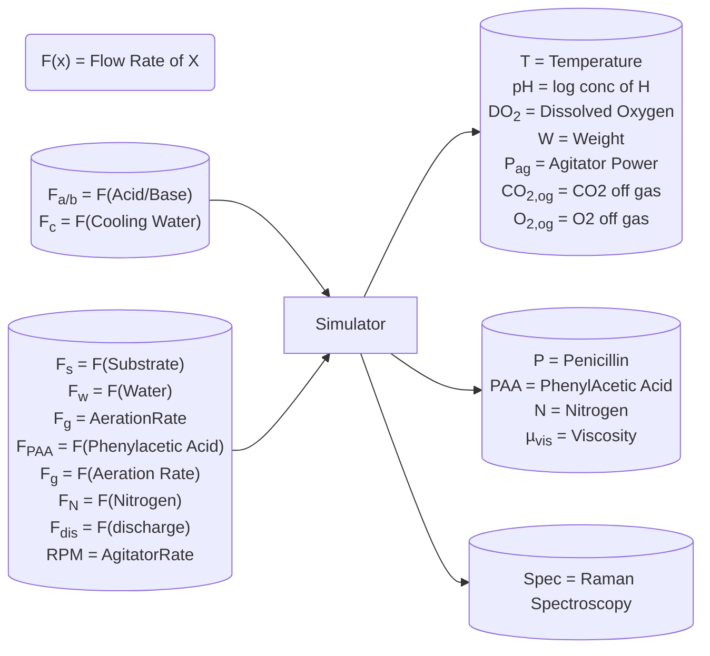

# Paper Summary

## Model Outputs

### Simulator Design

```mermaid
flowchart LR

Legend1("F(x) = Flow Rate of X")

Sim[Simulator]

AutoInputs[("
F<sub>a/b</sub> = F(Acid/Base)
F<sub>c</sub> = F(Cooling Water)")]
ManInputs[("
F<sub>s</sub> = F(Substrate)
F<sub>w</sub> = F(Water)
F<sub>g</sub> = AerationRate
F<sub>PAA</sub> = F(Phenylacetic Acid)
F<sub>g</sub> = F(Aeration Rate)
F<sub>N</sub> = F(Nitrogen)
F<sub>dis</sub> = F(discharge)
RPM = AgitatorRate")]

SensorOutputs[("
T = Temperature
pH = log conc of H
DO<sub>2</sub> = Dissolved Oxygen
W = Weight
P<sub>ag</sub> = Agitator Power
CO<sub>2,og</sub> = CO2 off gas
O<sub>2,og</sub> = O2 off gas
")]
PhysOutputs[("
P = Penicillin
PAA = PhenylAcetic Acid
N = Nitrogen
µ<sub>vis</sub> = Viscosity
")]
PATOutputs[("
Spec = Raman Spectroscopy
")]


AutoInputs & ManInputs --> Sim --> SensorOutputs & PhysOutputs & PATOutputs
```